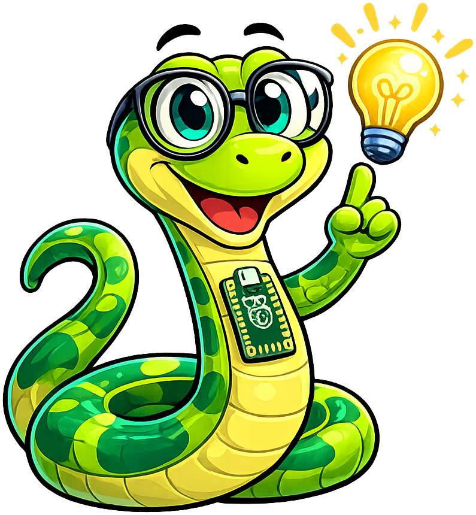
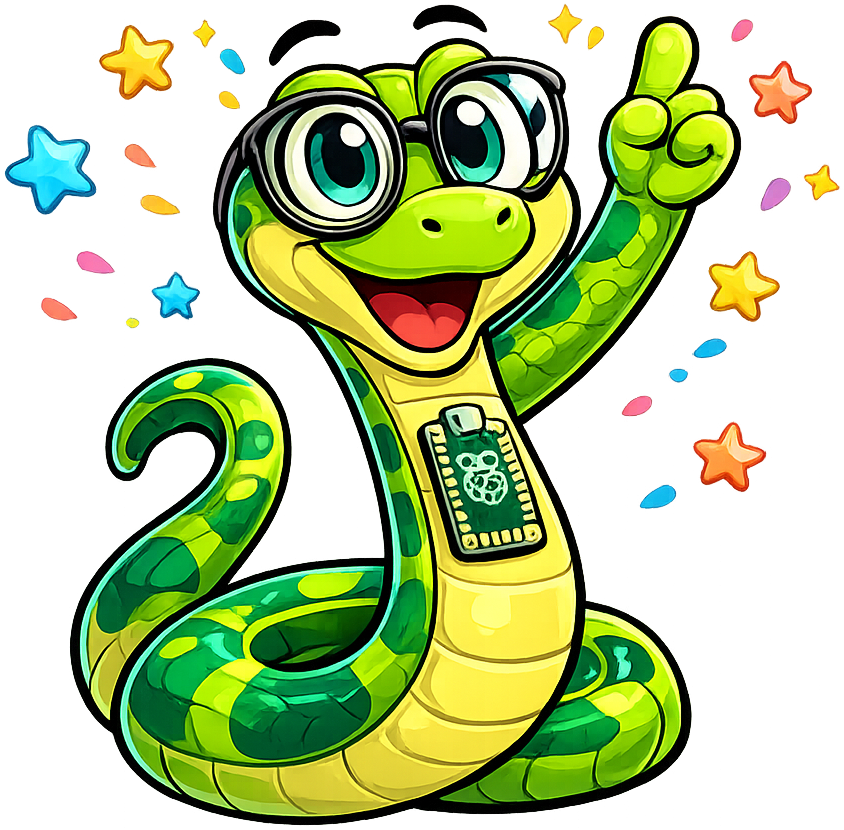

# Welcome to Python and Skulpt

## Summary

In this first chapter you meet **Monty** — your friendly python-snake guide —
and write your very first lines of Python code inside the Skulpt browser window.
You'll discover what Python is, why it's so popular, and get an exciting preview:
you'll run `import turtle` and watch Monty draw a shape right on the page.
By the end you'll know how to print messages, write comments, and understand
why Python is a great next step after Scratch.

## Concepts Covered

This chapter covers the following 9 concepts from the learning graph:

1. Python Interpreter Overview
2. Trinket.io Web Environment
3. Skulpt Browser Python
4. print() Function
5. Single-Line Comments
6. Case Sensitivity
7. Blank Lines and Readability
8. import Statement
9. import turtle

## Prerequisites

This chapter builds on concepts from:

This is the very first chapter — no prerequisites needed beyond familiarity with Scratch!
This chapter assumes only the prerequisites listed in the [course description](../../course-description.md).

---

By the end of this lesson you'll be able to:

- Run Python code right inside your browser without installing anything
- Use `print()` to display messages on the screen
- Write single-line comments to explain what your code does
- Import the turtle library and watch it draw a shape on the page

You've been coding with colorful blocks — snapping pieces together in Scratch to make sprites move, say things, and react to clicks. Now it's time for the next adventure: writing **Python**, one of the most popular programming languages in the entire world. The good news? Everything you already know from Scratch still works — it just looks a little different in Python.

!!! mascot-welcome "Hi! I'm Monty."
    { class="mascot-admonition-img" }
    Welcome to **Beginning Python — From Blocks to Code**! I'm **Monty**, a friendly python snake who lives right here in your textbook. I'll pop up throughout every lesson, but never randomly — I have exactly **seven jobs**, and you'll quickly learn to recognize me by which one I'm doing:

    1. **Welcome you** at the start of every lesson — exactly what I'm doing right now.
    2. **Help you think and predict** before you run a program, so you build the habit of reasoning through code before executing it.
    3. **Give you tips** — the clever moves that experienced programmers use that nobody bothers to write down.
    4. **Bridge to Scratch** — whenever a Python idea has a direct Scratch equivalent, I'll connect the two so you can use what you already know.
    5. **Warn you** about the spots where even careful coders trip up — common mistakes, sneaky bugs, and easy-to-miss rules.
    6. **Encourage you** when a concept looks hard at first — some ideas take a moment to click, and that is completely normal.
    7. **Celebrate with you** at the end of every lesson when you have earned it.

    That is it. If I am not doing one of those seven things, I am not in the lesson. Let's code it together!

## What is Python?

Scratch uses colorful blocks that snap together. Python uses **text** — words and symbols you type on a keyboard. A **programming language** is a set of rules for writing instructions that a computer can follow. Python is one of those languages, and it is a great choice because it reads almost like plain English.

When you write a Python program, something called the **Python interpreter** reads your code one line at a time from top to bottom and carries out each instruction. Think of the interpreter as a super-fast reader who turns your words into actions. In Scratch, clicking the green flag started your program. In Python, the interpreter does the same job — it starts at the very first line and works its way down.

Python was invented in 1991 by a programmer named Guido van Rossum. He named it after a British comedy show — not after the snake, even though the snake mascot fits perfectly! Today Python powers YouTube, Instagram, NASA robots, and artificial intelligence research. It is consistently ranked the most popular first programming language in the world for both beginners and professionals.

## Ways to Run Python

Before you write your first line of Python, it helps to know *where* Python runs. There are several options, and each one has its place in this course.

- **On your own computer** — You can install Python and run it from a terminal window. This is how professional programmers work, but it requires setup and is not where we start.
- **Trinket.io** — A website where you type Python in one panel and see results in another, all inside your browser. No installation needed, and many Python courses use it.
- **Skulpt (inline)** — This is the tool built right into *this* textbook. Skulpt is a version of Python that runs directly inside the web page you are reading right now. Every interactive code box in Chapters 1–18 is powered by Skulpt. You do not need to open a new tab, log in, or install anything. You click **Run** and the code executes here on the page.

In this course, **Skulpt** is your main tool for the early chapters. The table below summarizes all three environments:

| Environment | Where it runs | Needs install? | Best for |
|------------|--------------|---------------|----------|
| Your computer | Local terminal | Yes | Professional work |
| Trinket.io | Website | No | Sharing projects online |
| Skulpt (this book) | This web page | No | Instant in-lesson practice |

## Your First Python Line: print()

The very first thing most programmers learn is how to make a program display a message. In Python, the command is called **`print()`**.

A **function** is a named action that Python knows how to carry out. `print()` is Python's built-in "display a message" function. Whatever you put inside the parentheses — surrounded by quote marks — appears in the output area when the program runs.

!!! mascot-tip "Scratch Bridge"
    { class="mascot-admonition-img" }
    In Scratch you used the **"Say [ ] for 2 seconds"** block to make your sprite show a speech bubble. In Python, `print("Hello!")` does the same job — it makes your program display a message. The difference is that Python shows the message as plain text below the code, not as a speech bubble on a character.

## Sample Code: print()

Here is a short program with three `print()` calls. Read each line carefully before you run it:

```python
print("Hello, world!")
print("My name is Monty.")
print("Let's learn Python!")
```

**Before you click Run:** how many lines of text do you think will appear in the output box? Make your prediction, then try it!

## Try It Now

Edit the code below and click **Run** to see the result right on this page. No account needed — everything runs in your browser.

<script src="https://skulpt.org/js/skulpt.min.js"></script>
<script src="https://skulpt.org/js/skulpt-stdlib.js"></script>

<div id="skulpt-lab" class="skulpt-text-only">
  <div id="editor-container">
    <textarea id="code" spellcheck="false">print("Hello, world!")
print("My name is Monty.")
print("Let's learn Python!")
</textarea>
    <div id="button-row">
      <button id="run-btn" onclick="runSkulpt()">&#9654; Run</button>
      <button id="reset-btn" onclick="resetSkulpt()">&#8635; Reset</button>
    </div>
    <pre id="output"></pre>
  </div>
  <div id="canvas-container">
    <div id="turtle-target"></div>
  </div>
</div>

Were you right? You should see three lines of text appear, one for each `print()` call — Python runs them in order from top to bottom.

**If you see a red error message:** Check your spelling carefully. Python is case-sensitive, so `Print("Hello")` with a capital P won't work — it must be `print("Hello")` in all lowercase. Also make sure you have both an opening `"` and a closing `"` around your text.

## How print() Works

Each `print()` line runs one at a time, from the top of the program to the bottom — exactly the same order Scratch runs blocks inside a script. When Python sees `print("Hello, world!")` it does three things:

1. Reads the function name: `print`
2. Reads the text inside the parentheses: `"Hello, world!"`
3. Displays that text, then moves to the next line

The quote marks around the text are important. They tell Python that `"Hello, world!"` is a piece of text — what programmers call a **string**. A string is any sequence of characters (letters, numbers, spaces, punctuation) wrapped in quote marks. Without the quotes, Python would think you are writing the name of a variable or a command it does not recognize.

| Line | What it does |
|------|-------------|
| `print("Hello, world!")` | Displays the text: Hello, world! |
| `print("My name is Monty.")` | Displays the text: My name is Monty. |
| `print("Let's learn Python!")` | Displays the text: Let's learn Python! |

## Writing Comments with #

As your programs grow longer, it becomes helpful to leave notes for yourself and for anyone else who reads your code. In Python, a **comment** is a note that the interpreter completely ignores when running the program — it exists only for human readers.

You start a comment by typing a `#` character (called a hash or pound sign). Everything on that line after the `#` is treated as a note, not as code.

```python
# This line is a comment — Python ignores it completely
print("But Python runs this line!")

# Comments explain the WHY behind your code
print("They make programs easier to read.")
```

Good programmers use comments constantly. A comment does not change what the program does — it just helps the next person (often you, six months later) understand what you were thinking.

## Case Sensitivity

Python is **case-sensitive**, which means uppercase and lowercase letters are treated as completely different things. The command `print` and the word `Print` are not the same.

!!! mascot-warning "Capital Letters Matter!"
    { class="mascot-admonition-img" }
    One of the most common first-week mistakes is typing `Print("Hello")` with a capital P. Python will respond with a `NameError: name 'Print' is not defined` message. The fix is simple: always use lowercase `print()`. This rule applies to every Python command — `Forward` is not the same as `forward`, and `Turtle` (capital T) refers to something different from `turtle` (lowercase t). When you are learning a new command, always double-check the capitalization.

## Blank Lines Make Code Readable

Python does not care about blank lines — you can add as many empty lines as you like between statements and the interpreter ignores them all. But *human readers* care a great deal.

Blank lines divide your code into logical groups, the same way paragraph breaks divide a story into scenes. Two lines of code that do the same task belong together; two lines that do different tasks should be separated with a blank line (and optionally a comment label).

```python
# --- Introduction ---
print("Welcome to my program!")
print("Let's get started.")

# --- Main message ---
print("Python is fun to learn.")
print("You are doing great!")
```

Get into the habit early: if two chunks of code do different jobs, separate them with a blank line. Your programs will be much easier to read — and to fix when something goes wrong.

## Importing Libraries with import

One of Python's greatest strengths is its huge collection of pre-built tools. You can bring any of those tools into your program with an **`import` statement**.

The keyword `import` tells the Python interpreter: "I need this extra toolkit — please load it before running the rest of my program." By itself Python knows how to do many things (`print`, basic math, and more), but libraries like `turtle`, `random`, and `math` must be imported before you can use them.

An import statement always goes at the very **top** of your program — before any other code — so Python loads the library before it needs it.

```python
import turtle   # Load the turtle library
```

After that one line, everything in the turtle library is available to your program.

## Drawing with import turtle

The **turtle** library lets you draw pictures by moving a virtual pen around the screen. Imagine a tiny turtle holding a pen. When you tell the turtle `forward(100)`, it walks forward 100 steps and draws a line as it goes. When you tell it `right(90)`, it pivots 90 degrees clockwise.

Every turtle program starts the same way:

```python
import turtle
t = turtle.Turtle()
```

The first line loads the library. The second line creates a turtle and gives it the name `t`. Once you have a turtle, you direct it using dot notation — `t.forward(100)` means "tell turtle `t` to go forward 100 steps."

## Sample Code: Drawing a Shape

Here is a short turtle program. It calls `forward(100)` and `right(90)` several times in a row:

```python
import turtle

t = turtle.Turtle()
t.forward(100)
t.right(90)
t.forward(100)
t.right(90)
t.forward(100)
t.right(90)
t.forward(100)
```

!!! mascot-thinking "What Shape Will Monty Draw?"
    { class="mascot-admonition-img" }
    Look at the program above. The turtle calls `forward(100)` four times and `right(90)` three times in between. The number 90 is the number of degrees in each right turn. How many sides will the finished shape have, and what is the name of that shape? Make your guess — then click Run to find out!

## Try It: Turtle Graphics

<div id="skulpt-lab-2">
  <div id="editor-container-2">
    <textarea id="code-2" spellcheck="false">import turtle

t = turtle.Turtle()
t.forward(100)
t.right(90)
t.forward(100)
t.right(90)
t.forward(100)
t.right(90)
t.forward(100)
</textarea>
    <div id="button-row-2">
      <button id="run-btn-2" onclick="runSkulpt('-2')">&#9654; Run</button>
      <button id="reset-btn-2" onclick="resetSkulpt('-2')">&#8635; Reset</button>
    </div>
    <pre id="output-2"></pre>
  </div>
  <div id="canvas-container-2">
    <div id="turtle-target-2"></div>
  </div>
</div>

Were you right? The turtle draws a **square** — four sides of equal length with a 90-degree right turn between each side. Four turns of 90 degrees adds up to 360 degrees, which is one full rotation, so the turtle ends up facing the same direction it started.

## How the Turtle Program Works

Let's trace through each line:

| Line | What it does |
|------|-------------|
| `import turtle` | Loads the turtle graphics library |
| `t = turtle.Turtle()` | Creates a new turtle and names it `t` |
| `t.forward(100)` | Moves `t` forward 100 steps, drawing a line |
| `t.right(90)` | Turns `t` clockwise by 90 degrees |

The number inside `forward()` controls how far the turtle walks — bigger numbers draw longer lines. The number inside `right()` controls how sharply the turtle turns — 90 degrees makes a square corner. Changing these two numbers is how you draw different shapes.

## Learning Check

!!! mascot-thinking "Your Turn — Complete the Triangle!"
    { class="mascot-admonition-img" }
    The program below draws **two sides** of a triangle and then stops. A triangle has three equal sides, with a 120-degree right turn at each corner. Add **one line** — `t.forward(100)` — to draw the missing third side and close the triangle!

<div id="skulpt-lab-3">
  <div id="editor-container-3">
    <textarea id="code-3" spellcheck="false">import turtle

t = turtle.Turtle()
t.forward(100)
t.right(120)
t.forward(100)
t.right(120)
# Add one line here to complete the triangle!
</textarea>
    <div id="button-row-3">
      <button id="run-btn-3" onclick="runSkulpt('-3')">&#9654; Run</button>
      <button id="reset-btn-3" onclick="resetSkulpt('-3')">&#8635; Reset</button>
    </div>
    <pre id="output-3"></pre>
  </div>
  <div id="canvas-container-3">
    <div id="turtle-target-3"></div>
  </div>
</div>

When you add the missing line and click Run, the turtle should draw a closed triangle. If the shape does not close, double-check that your added line spells `forward` in all lowercase and uses parentheses with the number 100 inside.

## Experiments

Try these changes to the programs above. For each one, **predict what will happen first** — then run it to check!

1. **Change a message in `print()`**. Replace `"Hello, world!"` with your own name, like `print("Hello, I'm Alex!")`. **You'll know it worked when** your name appears in the output box.

2. **Add a fourth `print()` line** with a message of your choice. **You'll know it worked when** four lines of text appear in the output, not three.

3. **Change `forward(100)` in the square to `forward(200)`**. **You'll know it worked when** the square is twice as wide and tall.

4. **Draw a different shape**: change the square program to use `right(60)` and repeat `forward(100)` and `right(60)` six times. **You'll know it worked when** you see a six-sided hexagon.

5. **Challenge — change the speed**: add the line `t.speed(1)` right after `t = turtle.Turtle()` in the square program. Run it and watch what happens. Then try `t.speed(10)`. **You'll know it worked when** the drawing speed visibly changes between the two runs.

!!! mascot-celebration "Fantastic Work!"
    { class="mascot-admonition-img" }
    You just wrote your very first Python programs — and they actually ran! You used `print()` to display messages, `#` to write comments, `import` to load a library, and `import turtle` to draw a shape on screen. That is nine brand-new concepts in one chapter, and you handled every single one. You have got this — let's keep coding together!
