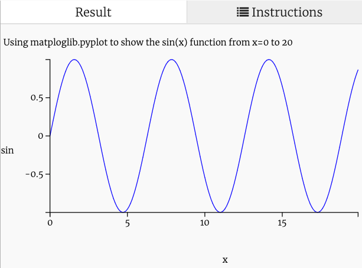

# Using Trinket to Learn MatPlotLib
Python is notable for having a rich library of tools for viewing data.  In this lesson we will use
Trinket to learn how to use the popular matplotlib - a Python library for plotting data.

This example uses the trigonometry function Sine.  Don't worry if you have not taken a trigonometry yet.  It is just a simple function that generates a wave of vertical height that range between -1 and 1 as we move down the X axis.  Imagine a circle rotating and the sin() function will reflect the angle of a point on the edge of the circle going up and down and the circle turns.

See the [Wikipedia Article on Sine](https://en.wikipedia.org/wiki/Sine) for a description of the function.

## How Matploglib works
In order to get a plot of any function on the screen we need to first generate a list of points.  Each point has an x and y coordinate and the point (0,0) is usually on the middle left corner of the screen.

Trinket has a plotting area of about 200 by 200 pixels.  So we will generate 200 points and plot them to get our chart.

One of the best ways to get started is to create two lists: one of x coordinates and one of y coordinates like this:

```py
x_list = []
y_list = []
```

We then need to create a loop that has the x range change uniformly from 0 to 200 and then for each of these x values we will generate a y value and put them into the list.  We will use the list.append() function to add these numbers in pairs to both the X and Y lists like this:

```py
for p in range(0,200): # we will use 200 points
        x_list.append(p/10)
        y_list.append(math.sin(p/10))
```

In this case "p" is just a temporary counter for each point we are going to add.  We are also going to divide both the X and Y values by 10 so that we get the values from 0 to 20 (not 0 to 200).  That way we can see how the sin() function varies in this range.

Once we have our x and y points in two lists we are ready to plot.

Here is how we use the matplot library:

```
import matplotlib.pyplot as plt
...
plt.plot(x_list,y_list)
plt.show()
```
Each time we change the list values we need to run the plt.show() function to do the drawing.

## Full Example
Here is a full working example.  Note that we need to import the math library to use the sin() function.

```
import matplotlib.pyplot as plt
import math

x_list = []
y_list = []
for p in range(0,200): # we will use 200 points
        x_list.append(p/10)
        y_list.append(math.sin(p/10))

plt.title('Using matploglib.pyplot to show the sin(x) function from x=0 to 20')
plt.xlabel('x')
plt.ylabel('sin(x)')
plt.plot(x_list,y_list)
plt.show()
```



## Getting Fancy
We can also put a grid axis and color on the plot:

plot.grid(True, which='both')
