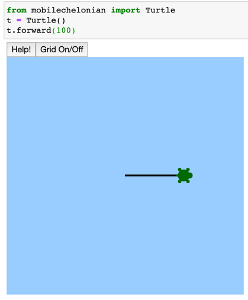

## Why Jupyter Notebook
We will be running this library from within a Jupyter Notebook.  Jupyter Notebooks are part of an important type in programming called [Literate Programming](https://en.wikipedia.org/wiki/Literate_programming) where code and explaination of your code are interspersed in cells. Jupyter Notebooks are sometimes called the "New Excel" because they are both popular ways to analize data.  Jupyter Notebooks are also popular with Data Scientists and Artificial Intelligence developers and has almost compleatly replaced the [R Progamming](https://trends.google.com/trends/explore?date=all&geo=US&q=Jupyter,R%20Programming) programming language.

We think that learning Python using Jupyter is ideal if you have some type of interactive way to see the results of your code.  By combining turtle graphics with Jupyter you get the best of both worlds.

## Two Ways to View Turtle Graphics
There are two ways to view turtle graphics in Jupyter:
1. With the turtle being drawn in a separate window
2. With the turtle being drawn "inline" directly under your code

In general, inline is preferred because you can keep track of many small exercises just by scrolling down. You can also print out the notebooks to show others your work.

In many of these labs we will be using a special version of the turtle library that was developed by [Thomas Kluyver](https://github.com/takluyver) from the UK called the "mobilechelonian". We want to thank him for this work.  If you want you can "star" the following github repository: https://github.com/takluyver/mobilechelonian

Note that "Chelonians" are animals in the order Chelonia (or Testudines), which includes the turtles and tortoises.  By picking a very distinctive name for his implementation of the turtle library Thomas avoided collision with other python libraries that had the same name.

## Steps
Here are the steps we will go through to get turtle running in our Jupyter Notebook:

1. Install the conda python environment systems
2. Create a new conda environment for our turtle and activate it
3. Use the pip tool to install the turtle library
4. Install the Jupyter Notebooks software
5. Start up Jupyter Notebooks
6. Test the turtle program

## Install Conda
Google "install python" on your operating system.
Google "install conda"

## Create a new conda envornment:
Open your terminal.  Type in the following commands.

```shell
conda env list
conda create -n turtle python=3.6
conda activate turtle
pip install mobilechelonian
juypter notebook
```

After you run the last command it will open a Jupyter Notbook in a web browser.  You can now test that the turtle library installed correctly.

```python
from mobilechelonian import Turtle
t = Turtle()
t.forward(100)
```




## References
[Conda Documentation](https://docs.conda.io/projects/conda/en/latest/user-guide/tasks/manage-environments.html)

