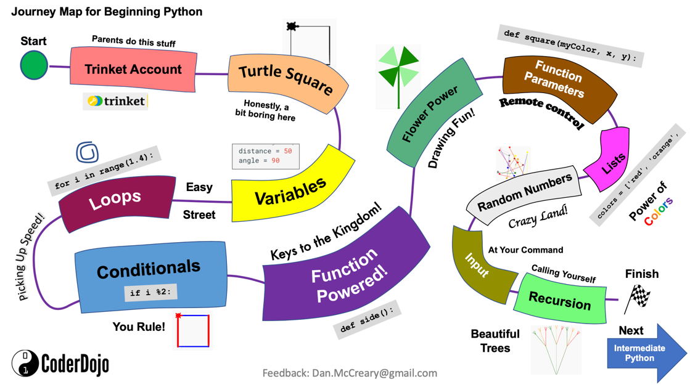

# Introduction 

## Introduction to Turtle Graphics with Trinket

These labs assume that you have internet access and a modern web browser such as Chrome.

We use the [Trinket web site](https://trinket.io/) because it a kid-safe place that has many of the basic turtle drawing libraries implemented in and easy-to-use web environment.  It is appropriate for students just getting started with python programming but has limited libraries for our advanced data analysis and plotting labs.  The free version is limited to the older Python 2.X functionality, but this meets all the needs of our beginning python class.

If you want to try another web-based system that support turtle graphics and Python 3.X we suggest the web site [repl.it](http://repl.it).  Note that repl.it is not specifically designed for kids.

## Beginning Python Journey Map

The map above is a visual guide to our Introduction to Python course.  Students start their journey in the upper left corner at the green start circle.  They then journey through each of the lessons until they reach the finish line.  Many of our courses give badges and laptop stickers for students that complete the journey from the start to the finish.

## List of Trinket Python Learning Labs
For students that are new to programming, here are some sample programs (what we call learning labs) that you can try.  You can learn by reading the sample programs, going to the Trinkit.io site and changing some values in the code.  Each of the labs has experiments at the end you can do to extend to see if you have mastered the concepts before you go on to the next lab.

1. [Trinket Account](./01a-trinket-account.md) - introduction to the Turtle Graphs library with a list of drawing functions
2. [Turtle graphics](./01b-turtle-graphics.md) - introduction to the Turtle Graphs library with a list of drawing functions
3. [Simple square](./02-simple-square.md) - draw a square by moving and turning right four times
4. [Variables](./03-variables.md) - add variables for the move edge distance and angle
5. [Loops](./04-loops.md) - add a loop to make our code smaller
6. [Conditionals](./05-conditionals.md) - add an if statement to change the color
7. [Functions](./06-functions.md) - create a shape function
8. [Function parameters](./07-function-parameters.md) - add parameters to our function
9. [Random](./08-random.md) - generate random numbers that are used do drive the turtle
10. [Lists](./08-list.md) - store a list of colors
11. [Inputs](./11-input.md) - get some input from the user
12. [Recursion](./12-recursion.md) - create a function that calls itself to draw a tree
13. [Shapes](./13-shape-module.md) - creating a separate module to draw shapes
14. [Color picker](./14-color-picker.md) - picking different colors
15. [Sine wave](./15-sine-wave.md) - creating a sine wave
16. [Changing Background](./16-changing-background.md) - changing background image and capturing keyboard 
17. [Controlling MouseClicks](./17-controlling-mouseclicks.md) - Tracking mouse clicks

