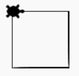

## Drawing a Square
The following code is an example of drawing a square using turtle graphics.  In this example the turtle moves foward 100 units and then turns right.  The angle for the right turn is 90 degrees.  It repeats these two functions four times to make a square.

## Sample Code
```python
import turtle
dan = turtle.Turtle()
dan.shape('turtle')

dan.forward(100)
dan.right(90)

dan.forward(100)
dan.right(90)

dan.forward(100)
dan.right(90)

dan.forward(100)
dan.right(90)
```
## Drawing


## Try it out
Here is a link to the Trinket web site with this program running:
[https://trinket.io/python/564899ffe9](https://trinket.io/python/564899ffe9)
You can click on this link and then press the Run button.  You should see the python code on the left side and the drawing on the right side of your screen.

## Explaination
The first three lines will be the same for all our programs.  They import the turtle library into our program, create a new turtle object and then assign the turtle a shape icon.  Although almost all the turtle libraries work this way, there are some minor differences you will see in future examples.

## Reorinenting your turtle
Note that at the start, the turtle is facing to the right.  After the last instruction, it is also facing to the right.  This is a common best practice so that the turtle gets reoriented after some drawing function.  If you remove the last right(90) function and run the program again you will see the turtle ends up facing upward.  But if you rerun the progam you will still get the same square because the orientation of the turtle is not stored between runs.

## Experiments
Can you change the distance and angle the turtle moves?  What happens when you change the numbers for the forward and right functions?  Can you go left as well as right?

Can you add more motion commands using the copy and paste?