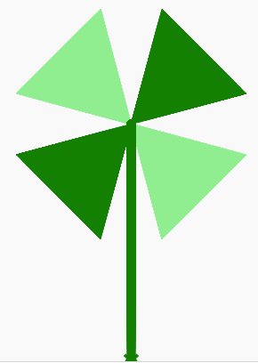

## Flower

Now we will create a new function that will draw a triangle for
each side.  It will do this by going forward and right three times
at an angle of 120 degrees.  We will put that triangle into a
function called petal.  We will then call that function four times.
At the end we will draw the stem.  To make the stem wider we will
change the pen size.

## Sample Code
```python
import turtle
dan = turtle.Turtle()
dan.shape('turtle')

distance = 100
angle = 120

def petal():
   if i % 2:
      dan.color('green')
   else:
      dan.color('lightgreen')
   dan.left(30)
   # draw a triangle and fill in the color
   dan.begin_fill()
   dan.forward(distance)
   dan.right(angle)
   dan.forward(distance)
   dan.right(angle)
   dan.forward(distance)
   dan.end_fill()
   dan.left(angle)

# start off 45 right
dan.right(45)
# repeat the forward/right functions four times
for i in range(4):
   petal()
# now draw the stem
dan.pensize(10)
dan.right(45)
dan.forward(200)
   
dan.write('done with flower')
```

## Drawing


## Run the Example
[Function](https://trinket.io/python/0de967d3e2)


## Experiments
1. Can you change the colors of the petals?
2. Can you change the width of the stem of the flower using the pensize() function?
3. Can you change the size of the petals?
4. Can you change the number of petals?