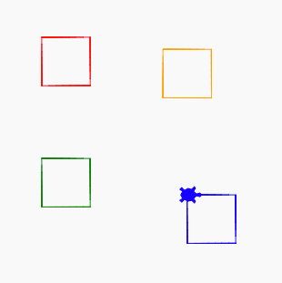

# Function Parameters

## Lesson Objective
Now we will create a new function that draw a square with a specific color at a specific x and y point.  The function will take three inputs:
- the color
- the horizontal x position on the grid
- the vertical y position on the grid

## Sample Code
```python
import turtle
dan = turtle.Turtle()
dan.shape('turtle')

size = 40
angle = 90

def square(myColor, x, y):
   dan.color(myColor)
   dan.penup()
   dan.goto(x, y)
   dan.pendown()
   for i in range(4):
      dan.forward(size)
      dan.right(angle)
   
   
square('red', -50, 80)
square('orange', 50, 70)
square('green', -50, -20)
square('blue', 70, -50)
```
## Drawing


[Link to Function in Trinket](https://trinket.io/library/trinkets/83e78b10f5)


## Experiments

1. Can you change the name of the function to be "petal"?
2. Can you change the function to include the ability to pass in one color for the border, and one color for the center fill?
[Sample of Border Square Program](https://trinket.io/python/3377b0fbd8)