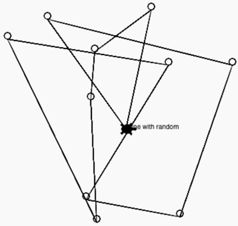

## Random Circles

In this exercise we will draw 10 random circles on the screen.  We will use the random function **randint(min, max)** that will generate a random number between the minimum and maximum values.  Since we are drawing on a grid that goes from -200 to 200 here is the random function:

```
myNumber = random.randint(-200, 200)
```
After this line runs, the variable myNumber will be assigned some random number between -200 and 200.   We will then use this number to go to that location before we draw a circle.

## Sample Code
```python
import turtle
import random
# this is a list of colors
colorList = ['red', 'orange', 'yellow', 'green', 'blue', 'purple', 'pink', 'brown', 'gray', 'gold']
dan = turtle.Turtle()
dan.shape('turtle')

# draw a circle at a random location on the screen
for i in range(10):
   x = random.randint(-200, 200)
   y = random.randint(-200, 200)
   dan.goto(x,y)
   # pick a random color from the colorList by getting a random index from 0 to 9
   dan.color(colorList[random.randint(0,9)])
   # draw a circle with radius of 7 units
   dan.begin_fill()
   dan.circle(7)
   dan.end_fill()

dan.goto(0,0)
```
## Drawing


[Draw 10 circles example on Trinket](https://trinket.io/python/00e2353a96)


## Experiments
1. Can you create a variable that is used to control the distance from the origin to wander?  Right now the distance is set to be 200 on each extent.
2. Can you create a variable for the number of circles to draw?
3. Go to the [Trinket colors page](https://trinket.io/docs/colors) and see the name of other colors you can use.  Note that you can use 