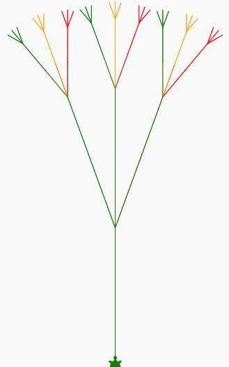

## Recursion
Recursion is when we write a function that calls itself.  It usually passes a parameter that changes and when it hits a limit it stops going.  This lab does a lot of drawing so to speed it up we will disable the turtle motion.

Our recursive function is the draw_branch function.  It will draw a single branch and then call itself two times at its tip to draw two more smaller branches.

## Sample Code
```python
import turtle

colorList = ['red', 'orange', 'green', 'blue', 'indigo', 'violet', 'brown']

def draw_branch(turtle, color, size, level):
  if level > 1:
    turtle.pendown()
    turtle.color(color)
    turtle.forward(size)
    turtle.right(20)
    # draw three branches at half length with a branch on the tip of each branch 
    for i in range(0, 3):
       turtle.forward(size/2)
       draw_branch(turtle, colorList[i], size/2, level - 1)
       turtle.backward(size/2)
       turtle.left(20)
    turtle.right(40)
    turtle.backward(size)
    
myTurtle = turtle.Turtle()
myTurtle.shape("turtle")
myTurtle.speed(50)

length = 150
numberPetals = 6
myTurtle.penup()
# move to the bottom center
myTurtle.goto(0, -200)
myTurtle.left(90)

draw_branch(myTurtle, colorList[0], length, 4)

```
## Drawing


## Link to Program on Trinket
[Link to Program on Trinket](https://trinket.io/python/0406ae2ac0)

## Explanation
The first three lines will be the same for all our programs.  They import the turtle library into our program, create a new turtle object and then assign the turtle a shape icon.

Note that at the start, the turtle is facing to the right.  After the last instruction, it is also facing to the right.

## Experiments
Can you change the distance and angle the turtle moves?  What happens when you change the numbers for the forward and right functions?  Can you go left as well as right?

Can you add more motion commands using copy and paste?