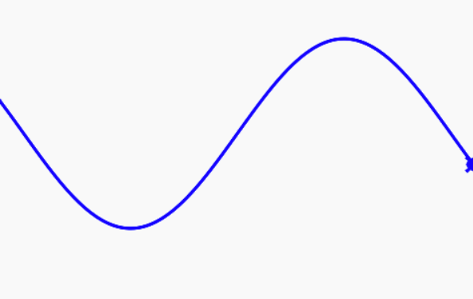

# Sine Wave
We can also use turtle graphics to do math function plots.

Here is an example of plotting a sine function with turtle goto() functions.  We calculate the new vertical value with the following function:

```py
y = math.sin(math.radians(x))
dan.goto(x, y * 80)
```

And we loop through about 400 values from -200 to 200.  We use the radians() function to convert the numbers into a a number that will give us a single sine in the X range.

```py
import turtle
dan = turtle.Turtle()
dan.shape('turtle')
# needed for the sin function
import math

dan.penup()
dan.goto(-200, 28)
dan.color('blue')
dan.pensize(3)
dan.pendown()
for x in range(-200, 200):
    y = math.sin(math.radians(x))
    dan.goto(x, y * 80)
```

Here is the output of this function:



## Link to Working Trinket Program

[Link to Turle Sine Wave](https://trinket.io/python/b6a5eaf8d1)
